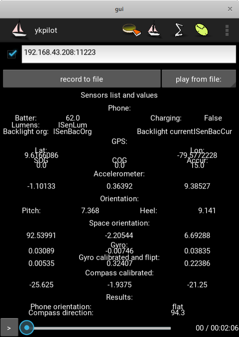
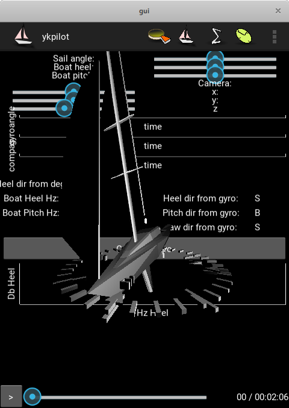
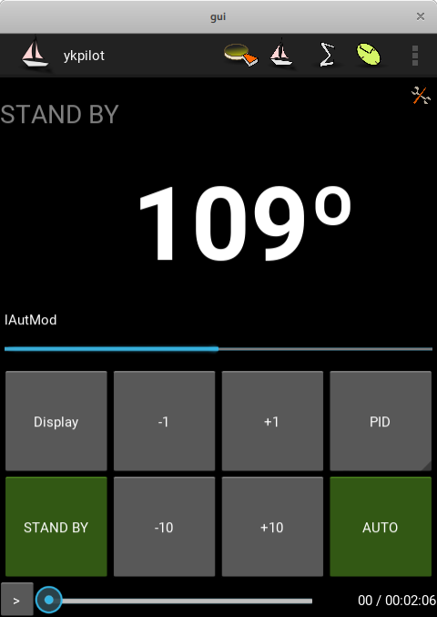
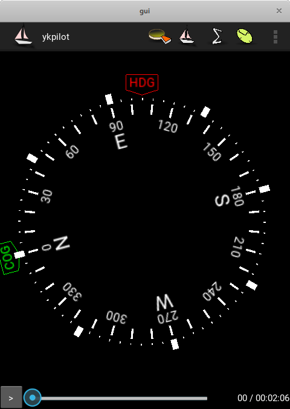
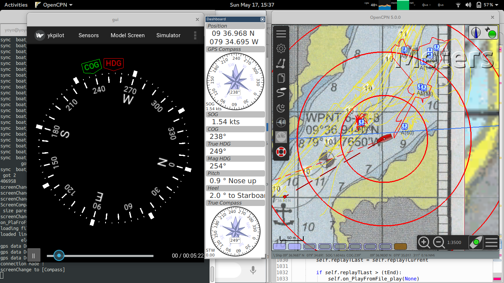

# ykpilot
Monohull sailboat / monohull powerboat autopilot base on android device :)

#Screeenshots of the app in action:

###Sensors screen.

to see, trace, debug what axis is what

###Model screen.

to see boat in sensors perspective view. 

###Autopilot.

Now in heavy progress. it's posible to select driver.
for now qrl QReinforceLernig or pid :)

###Compass screen.

one of many instruments to come

###Nmea and connectivity.

so with it you can use phone as a gps reciver and by wifi you can get data in yout opencpn
sends allso more information then only gps, heel, pitch, hdg ....